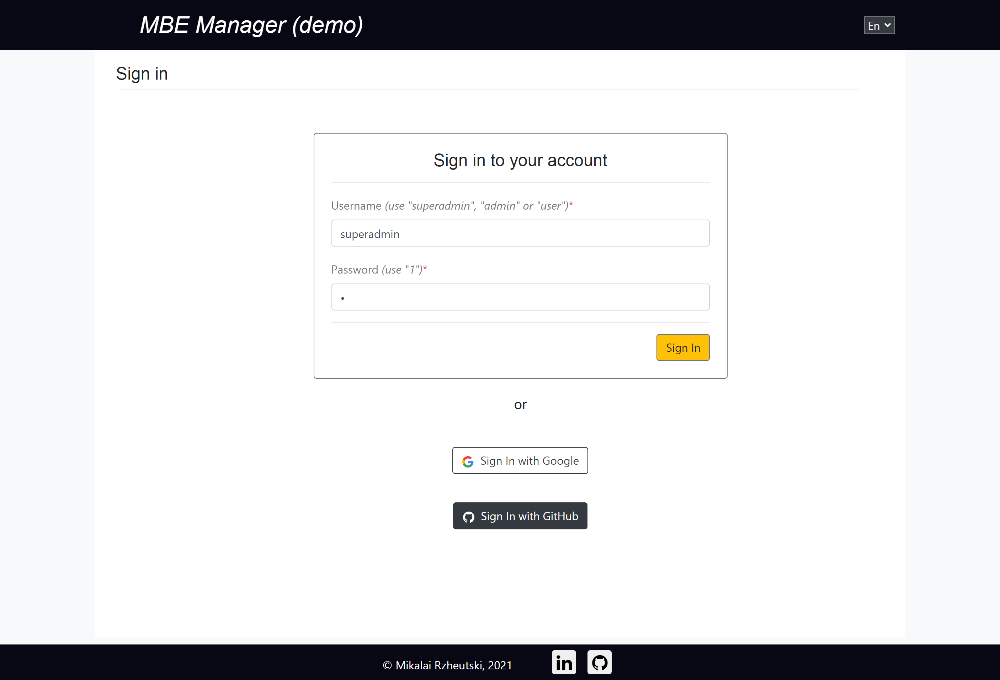
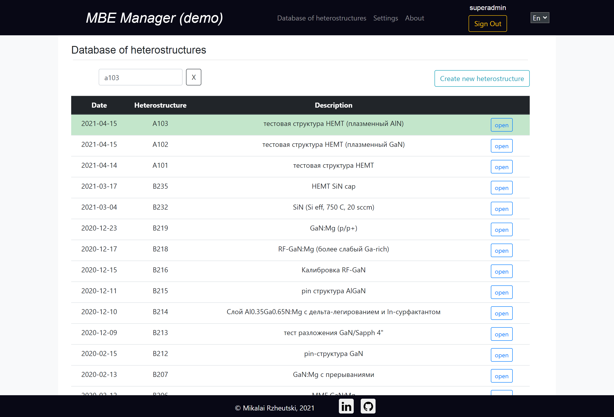
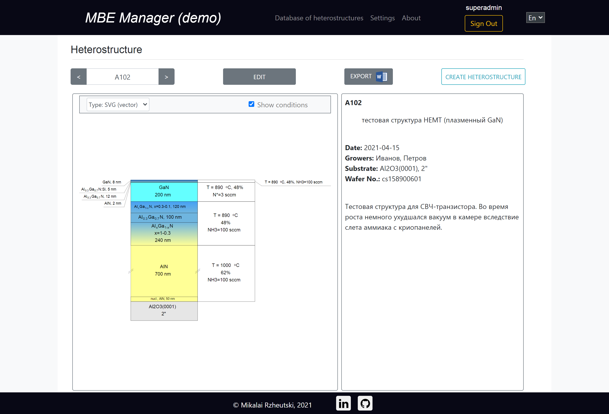
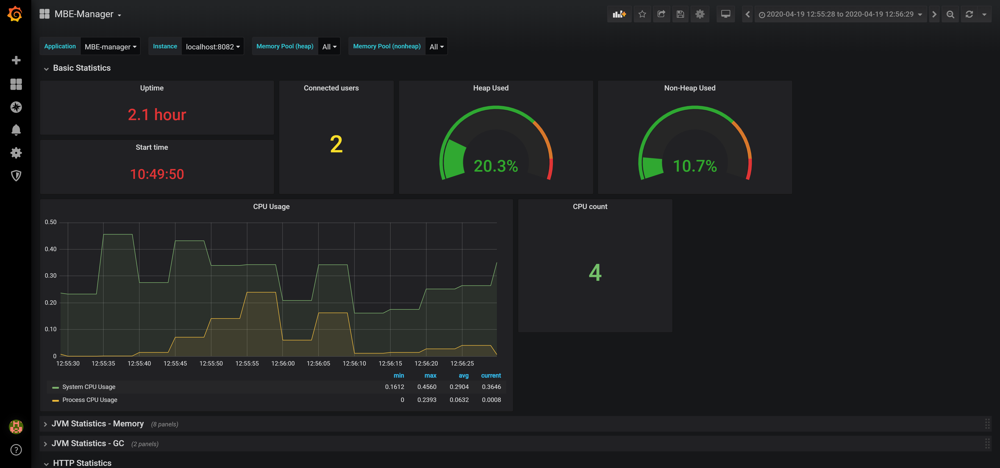
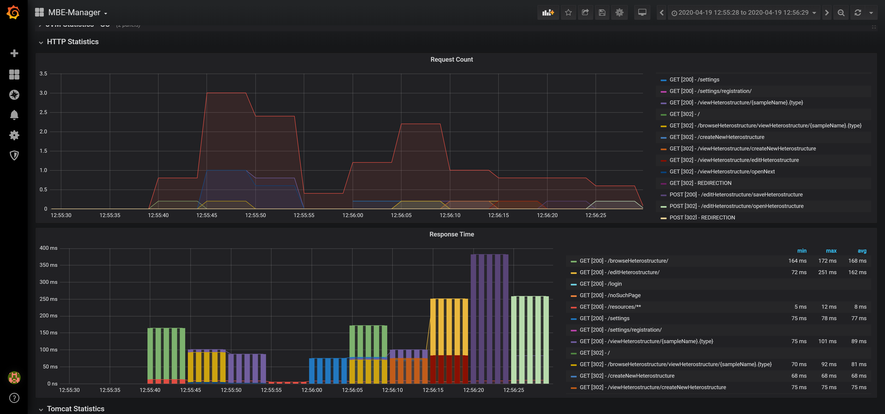
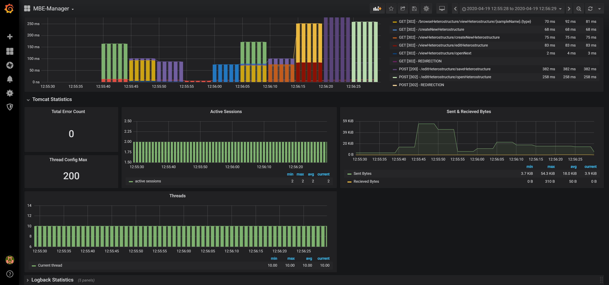

# MBE-Manager
> Electronic workbook for scientific experimental system

## Table of contents
* [General info](#general-info)
* [Screenshots](#screenshots)
* [Technologies](#technologies)
* [Compiling and building](#compiling-and-building)
* [Setup](#setup)
* [To-do list](#to-do-list)
* [Status](#status)
* [Metrics](#metrics)
* [Contact](#contact)

## General info 
The project is used as an electronic workbook for the Molecular Beam Epitaxy (MBE) system in Institute of Physics of National Academy Sciences of Belarus (http://ifan.basnet.by/?page_id=1634).
The electronic workbook makes storage, retrieving and automatic generating of schematic diagrams of the scientific experimental data.

## Screenshots

## Technologies
* Spring-Boot - version 2.0.1
* JSP
* FreeHEP, Apache Batik, other

## Compiling and building  
* To create *war*: run **_"gradle build"_** in the directory with *"build.gradle"*
* JDK 8, Gralde 4.2

## Setup
1. Install a database and create the following environment variables for database connection:
    * *MBE_DB_DRIVER* is a databse driver (example: "org.postgresql.Driver")
    * *MBE_DB_URL* is a database URL (example: "jdbc:postgresql://localhost:5433/postgres")
    * *MBE_DB_USERNAME* is a database username
    * *MBE_DB_PW* is a database password
    * *MBE_CACHE_FOLDER* is a path to the folder which is used for cache to store the generated image files
2. Start the application
    * Without Docker: Run **_java -jar MbeManager-2.0.war_** in the directory with *MbeManager-2.0.war*
    * In Docker (without Prometheus & Grafana): Run **_start.bat_**
    * In Docker (including Prometheus & Grafana): Run **_start-with-monitoring.bat_**
3. Go to the application's page (e.g. http://localhost:8082)

## To-do list
* Localization
* User-defined color box for schematic diagrams
* Add functionalities for Setup, Liquid Nitrogen Consumption and Consumables

## Status
Project is in progress

## Metrics

## Contact
Created by Mikalai Rzheutski <mv.rzheutski@gmail.com> - feel free to contact me!